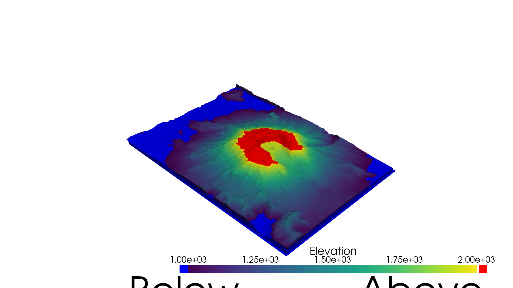
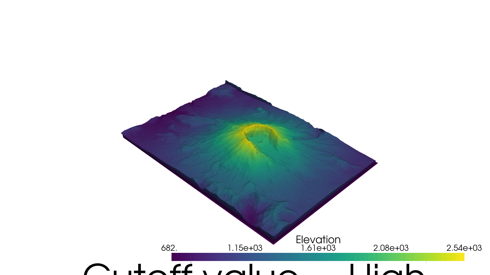
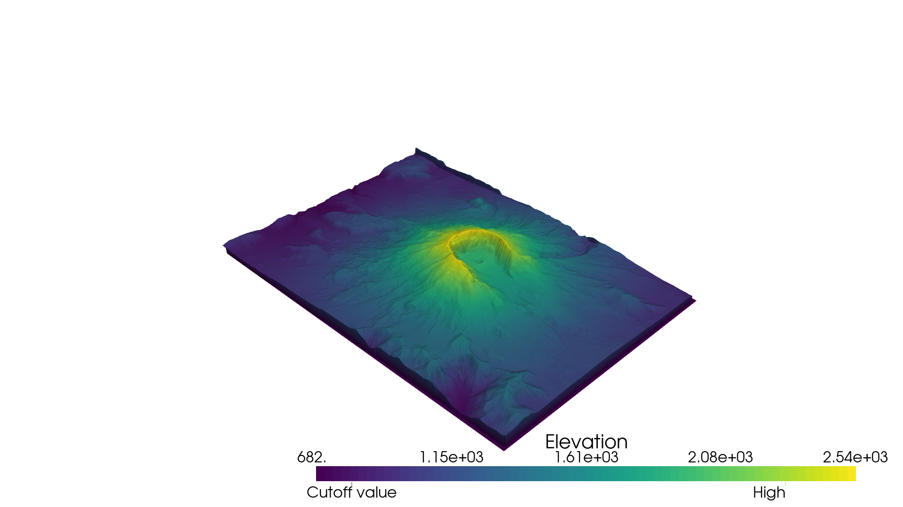

# Example for fix/add_scalar_bar-AnnotationTextScaling

**Fix**: Correct annotation text scaling setting, when fixed font size is given

## Example script

```python
import pyvista as pv
from pyvista import examples

# Load St Helens DEM and warp the topography
mesh = examples.download_st_helens().warp_by_scalar()

# Set document theme
pv.set_plot_theme('document')
# Set large window size and ...
pv.global_theme.window_size = [1920, 1080]

# set corresponding large fixed title and label font size
sargs = dict(
    title_font_size=20*2,
    label_font_size=16*2,
)

# Labelling values outside of the scalar range
p = pv.Plotter()
p.add_mesh(mesh, clim=[1000, 2000],
           below_color='blue', above_color='red',
           scalar_bar_args=sargs)
p.show(screenshot='scalar-bars-5.png')
```

**Picture 1: Original**

**Picture 1: Fixed**

```python
# Annotate values of interest using a dictionary. The key of the dictionary
# must be the value to annotate, and the value must be the string label.

# Make a dictionary for the annotations
annotations = {
    2300: "High",
    805.3: "Cutoff value",
}

p = pv.Plotter()
p.add_mesh(mesh, scalars='Elevation', annotations=annotations, scalar_bar_args=sargs)
p.show(screenshot='scalar-bars-6.png')
```

**Picture 2: Original**

**Picture 2: Fixed**
